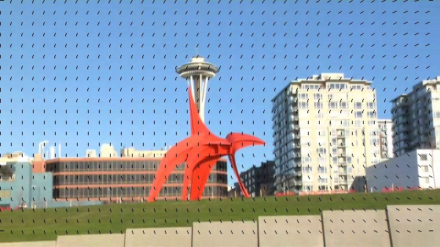
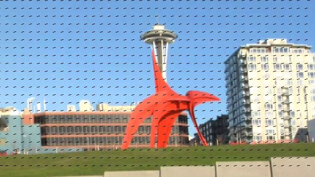

# System_Stabilitation_Interpolation

Stabilization system for mobile devices using interpolation


At a high level, stabilizes a video in four steps.

1) estimates the unstabilized video's motion by placing a mesh over it and
tracking how each mesh vertex moves. Each vertex moves with its nearby features.
2) computes how each mesh vertex should move in the stabilized video by
minimizing an energy function.
3) stabilizes the video by warping it so that each mesh vertex follows its stabilized
motion.
4) crops and resizes the video to fit its initial dimensions.

Because works with sparse mesh vertex motions instead of dense pixel motions,
the algorithm is relatively computationally cheap. Note that this implementation was built for
experimentation and is not optimized for speed.

## Usage

See `requirements.txt` for the implementation's dependencies.

### Basic usage

#### Example

Stabilize a video by constructing a `Stabilizer` object as shown below.

```
stabilizer = Stabilizer()

input_path = 'videos/video-1/video-1.m4v'
output_path = 'videos/video-1/stabilized-method-original.m4v'
stabilizer.stabilize(input_path, output_path)
```

### Advanced usage

#### Constructor

The `Stabilizer` constructor takes the following optional arguments.

* `mesh_row_count`: The number of rows contained in the mesh. Note that there are
`1 + mesh_row_count` vertices per row. Defaults to `16`.
* `mesh_col_count`: The number of columns contained in the mesh. Note that there are
`1 + mesh_col_count` vertices per column. Defaults to `16`.
* `mesh_outlier_subframe_row_count`: The height in rows of each subframe when breaking down
    the image into subframes to eliminate outlying features. Defaults to `4`.
* `mesh_outlier_subframe_col_count`: The width of columns of each subframe when breaking
    down the image into subframes to eliminate outlying features. Defaults to `4`.
* `feature_ellipse_row_count`: The height in rows of the ellipse drawn around each feature
    to match it with vertices in the mesh. Defaults to `10`.
* `feature_ellipse_col_count`: The width in columns of the ellipse drawn around each feature
    to match it with vertices in the mesh. Defaults to `10`.
* `homography_min_number_corresponding_features`: The minimum number of features
    that must correspond between two frames to perform a homography. Defaults to `4`.
* `temporal_smoothing_radius`: In the energy function used to smooth the image, the number of
    frames to inspect both before and after each frame when computing that frame's
    regularization term. Thus, the regularization term involves a sum over up to
    `2 * temporal_smoothing_radius` frame indexes. Note that this constant is denoted as
    $\Omega_{t}$ in the original paper. Defaults to `10`.
* `optimization_num_iterations`: The number of iterations of the Jacobi method to perform when
    minimizing the energy function. Defaults to `100`.
* `color_outside_image_area_bgr`: The color, expressed in BGR, to display behind the
    stabilized footage in the output. Note that this color should be removed during cropping, but is
    customizable just in case. Defaults to `(0, 0, 255)`.
* `visualize`: Whether or not to display a video loop of the unstabilized and cropped, stabilized
    videos after saving the stabilized video. Pressing `Q` closes the window. Defaults to `False`.

####  variants

In addition, `stabilize` takes an optional `adaptive_weights_definition` argument. This
argument specifies how to define the energy function's adaptive weights $\lambda_t$. The
argument's four Stabilizer.possible values, listed below, each describe a "variant" of
.

* `Stabilizer.ADAPTIVE_WEIGHTS_DEFINITION_ORIGINAL` (default): Calculate the adaptive
    weights using the linear model presented in the original paper. I made assumptions where the
    paper's description was vague.
* `Stabilizer.ADAPTIVE_WEIGHTS_DEFINITION_FLIPPED`: Calculate the adaptive weights using a
    variant of the original model in which one of the terms has had its sign flipped.
* `Stabilizer.ADAPTIVE_WEIGHTS_DEFINITION_CONSTANT_HIGH`: Set the adaptive weights to $100$
* `Stabilizer.ADAPTIVE_WEIGHTS_DEFINITION_CONSTANT_LOW`: Set the adaptive weights to $1$.
    This model is based on the authors' claim that smaller adaptive weights lead to less
    cropping and wobbling. Here both terms in the energy equation have equal weight.

#### Performance metrics

Finally, `stabilize` returns a tuple `(cropping_ratio, distortion_score, stability_score)` of three
performance metrics describing the stabilized video. These metrics are described in the original
paper. I made assumptions where the paper's definitions were vague.

An example of more advanced usage is shown below.

#### Example

```
stabilizer = Stabilizer(mesh_row_count=20, mesh_col_count=20, visualize=True)

input_path = 'videos/video-1/video-1.m4v'
output_path = 'videos/video-1/stabilized-method-original.m4v'
stabilizer.stabilize(
    input_path,
    output_path,
    adaptive_weights_definition=Stabilizer.ADAPTIVE_WEIGHTS_DEFINITION_CONSTANT_HIGH
)
```
### Initial motion vectors




### Final motion vectors


  

## Demos

Demo videos are available in the `videos` directory. Each subdirectory contains five videos:
an unstabilized video, and four stabilized versions stabilized by the four  variants
described above.

Video credits are available in `videos/credits.txt`.
